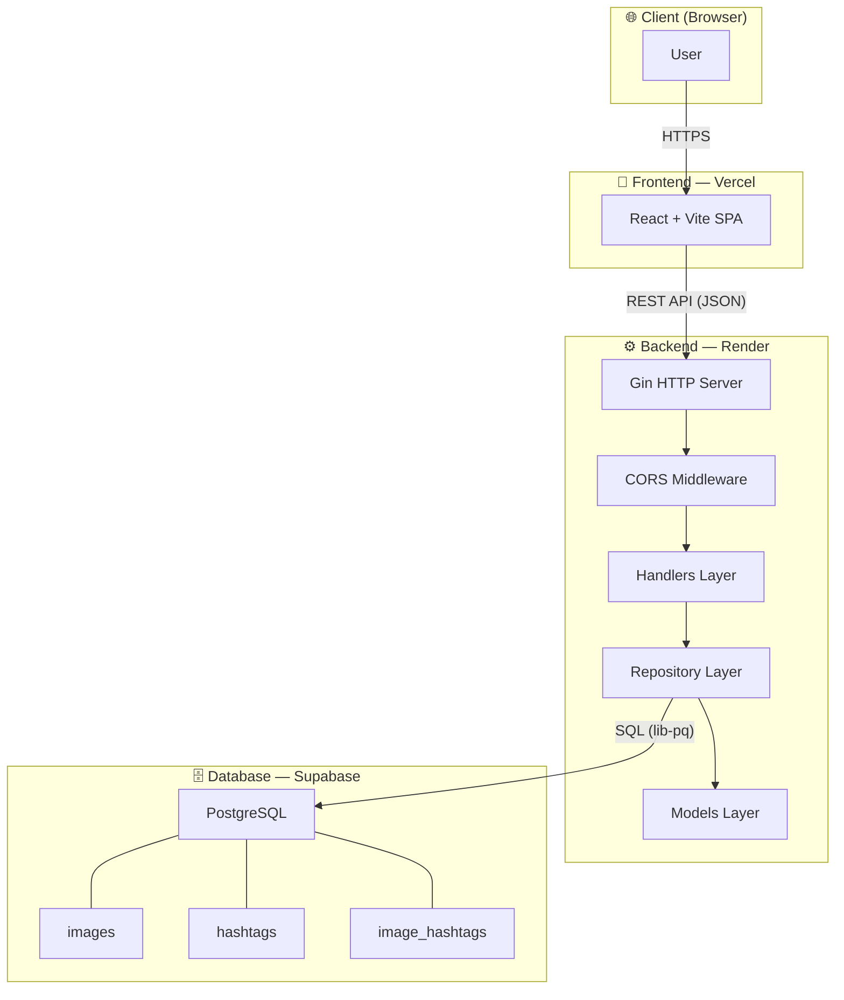
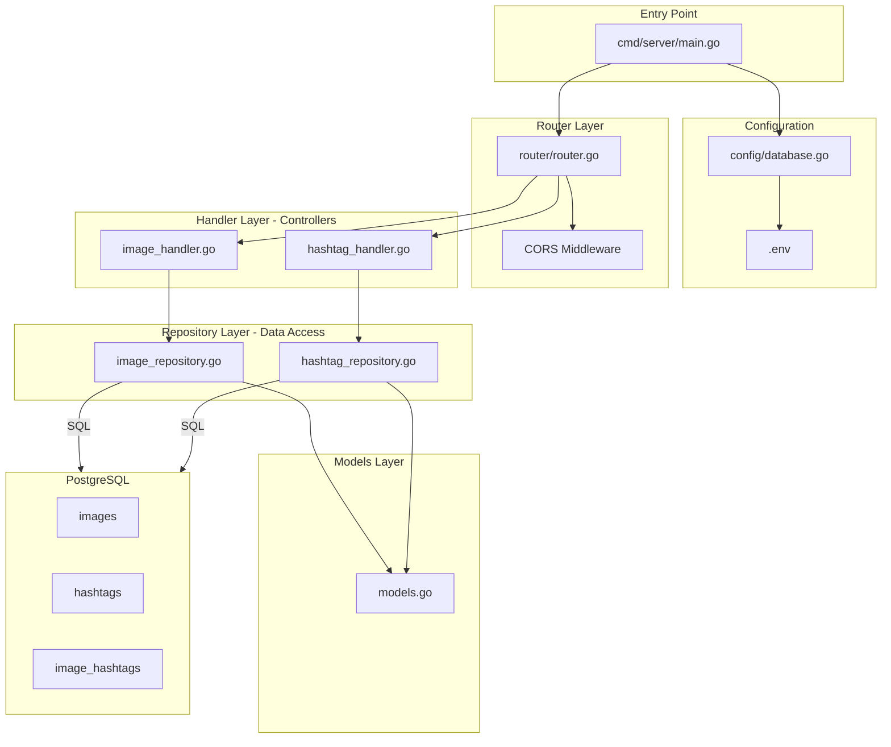
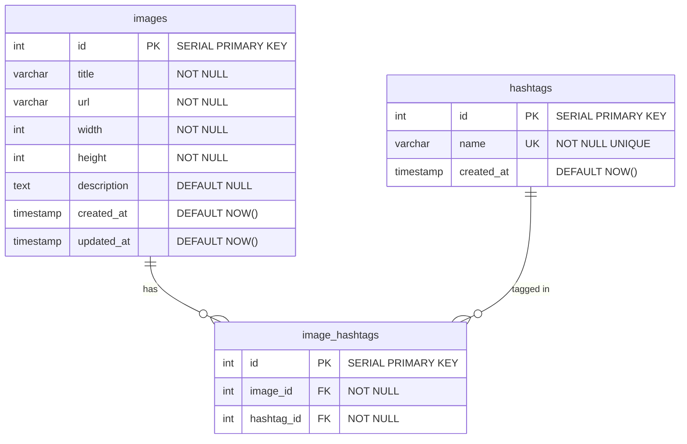
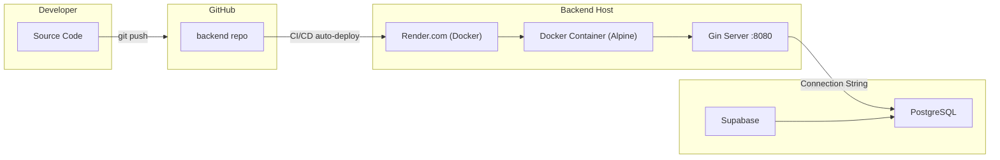

# Backend — Image Gallery API (Go + Gin)

## System Architecture

### High-Level Architecture



---

## Technology Stack

| Technology | Purpose |
|-----------|---------|
| **Go (Golang)** | Backend language |
| **Gin** | HTTP framework (Routing + Middleware) |
| **database/sql + lib/pq** | PostgreSQL driver |
| **gin-contrib/cors** | CORS middleware สำหรับ Frontend |
| **godotenv** | โหลด environment variables จาก `.env` |
| **PostgreSQL** | Relational Database |

---

## Backend Architecture



### Layer Responsibilities

| Layer | Package | Responsibility |
|-------|---------|----------------|
| **Entry** | `cmd/server/` | Bootstrap: load config → connect DB → start server |
| **Config** | `internal/config/` | Load `.env`, establish DB connection pool (25 open, 5 idle) |
| **Router** | `internal/router/` | Define API routes, attach CORS middleware |
| **Handlers** | `internal/handlers/` | Parse request params, validate, call repository, return JSON |
| **Repository** | `internal/repository/` | Execute SQL queries, map DB rows to model structs |
| **Models** | `internal/models/` | Data structs with JSON tags for API serialization |

### Data Flow

```
HTTP Request
    → Gin Router (CORS check)
        → Handler (parse query params, validate)
            → Repository (build SQL, execute query)
                → PostgreSQL (return rows)
            ← Repository (scan rows → model structs)
        ← Handler (build JSON response)
    ← Gin Router (send HTTP response)
HTTP Response
```

---

## Project Structure

```
backend/
├── .env.example                          ← DATABASE_URL, PORT
├── .gitignore
├── go.mod
├── go.sum
├── cmd/
│   └── server/
│       └── main.go                       ← Entry point
└── internal/
    ├── config/
    │   └── database.go                   ← DB connection + .env loader
    ├── models/
    │   └── models.go                     ← Image, Hashtag, Response structs
    ├── repository/
    │   ├── image_repository.go           ← SQL: GetImages (pagination + filter)
    │   └── hashtag_repository.go         ← SQL: GetAllWithCount
    ├── handlers/
    │   ├── image_handler.go              ← GET /api/images controller
    │   └── hashtag_handler.go            ← GET /api/hashtags controller
    └── router/
        └── router.go                     ← Gin routes + CORS config
```

---

## Database Schema (ERD)



---

## API Specification

### `GET /api/images`

ดึงรูปภาพทั้งหมด (รองรับ Infinite Scroll + **Multi-Select Hashtag Filter**)

| Param | Type | Default | Description |
|-------|------|---------|-------------|
| `page` | int | 1 | หมายเลขหน้า |
| `limit` | int | 15 | จำนวนรูปต่อหน้า (max 50) |
| `hashtags` | string | — | กรองตามชื่อ hashtag (ส่งได้หลายค่าโดยใช้ลูกน้ำคั่น เช่น `nature,city`) |

**Response (200 OK):**
```json
{
  "data": [
    {
      "id": 1,
      "title": "Breathtaking Landscape",
      "url": "https://placehold.co/600x400",
      "width": 600,
      "height": 400,
      "description": null,
      "created_at": "2026-03-25T03:00:00Z",
      "hashtags": [
        { "id": 9, "name": "landscape" },
        { "id": 1, "name": "nature" }
      ]
    }
  ],
  "page": 1,
  "limit": 15,
  "total": 60,
  "has_more": true
}
```

### `GET /api/hashtags`

ดึง Hashtag ทั้งหมดพร้อมจำนวนรูปภาพ

**Response (200 OK):**
```json
[
  { "id": 1, "name": "nature", "image_count": 22 },
  { "id": 9, "name": "landscape", "image_count": 35 }
]
```

### `GET /health`

Health check endpoint

**Response (200 OK):**
```json
{ "status": "ok" }
```

---

## Deployment

| Item | Detail |
|------|--------|
| **Provider** | Render (Production) / Docker Desktop (Local) |
| **OS/Software** | Linux (Alpine via Multi-stage Dockerfile), Go Runtime 1.26 |
| **Specs** | 0.1 CPU, 512MB RAM (Free Tier) |
| **Method** | โค้ดมีการตั้งค่า `Dockerfile` และ `docker-compose.yml` ครบถ้วนพร้อม Deploy! |

### Deployment Architecture



---

## Getting Started

### 🐳 วิธีที่ 1: รันผ่าน Docker (แนะนำ)
ตู้ Docker จะสร้าง Database พร้อมรัน `seed.sql` ให้อัตโนมัติ (ไม่ต้องหา Supabase ก็รันได้):
```bash
# รัน API ปกติ:
docker-compose up -d --build

# หากต้องการหยุดแอปและทำลายข้อมูลทิ้งเพื่อเริ่มใหม่:
docker-compose down -v
```

### 💻 วิธีที่ 2: รันสดบนเครื่อง (Development Mode)
```bash
# 1. Setup environment
cp .env.example .env
# แก้ไข DATABASE_URL ให้ตรงกับ PostgreSQL (Supabase)

# 2. Run server
go run ./cmd/server/
# → ✅ Connected to database
# → 🚀 Server starting on :8080
```

### Environment Variables

| Variable | Default | Description |
|----------|---------|-------------|
| `DATABASE_URL` | — (required) | PostgreSQL connection string |
| `PORT` | `8080` | Server port |

### Mock Data

มีไฟล์ `seed.sql` (อยู่ในโฟลเดอร์ `backend` หรือที่ root project) เพื่อจำลองข้อมูล Database:
```bash
# หากติดตั้ง PostgreSQL cli ไว้ในเครื่อง
psql "<YOUR_DATABASE_URL>" -f ./seed.sql

# วิธีที่ง่ายที่สุด (แนะนำ):
# Copy เนื้อหาทั้งหมดใน `seed.sql` ไปวางใน SQL Editor บน Supabase Dashboard แล้วกด Run!
```
