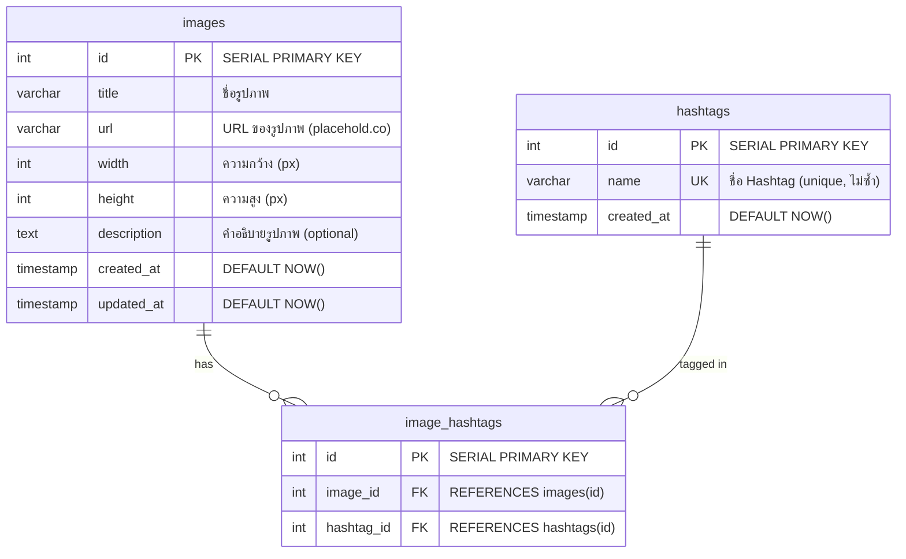

# Database Design — Image Gallery Assessment

## Overview
ระบบใช้ **PostgreSQL** สำหรับจัดการ Relational Data ระหว่าง Image และ Hashtag  
ความสัมพันธ์หลัก: **Many-to-Many** — รูปภาพ 1 รูปมีได้หลาย Hashtag และ Hashtag 1 ตัวสามารถอยู่ในรูปหลายรูป

---

## Entity Relationship Diagram (ERD)



---

## Table Definitions

### 1. `images` — ตารางเก็บข้อมูลรูปภาพ

| Column       | Type                     | Constraints                  | Description                              |
|-------------|--------------------------|------------------------------|------------------------------------------|
| `id`        | `SERIAL`                 | `PRIMARY KEY`                | Auto-increment ID                        |
| `title`     | `VARCHAR(255)`           | `NOT NULL`                   | ชื่อรูปภาพ                               |
| `url`       | `VARCHAR(500)`           | `NOT NULL`                   | URL ของรูปภาพ (e.g. placehold.co)       |
| `width`     | `INTEGER`                | `NOT NULL, CHECK(width > 0)` | ความกว้างของรูป (px) — ใช้กับ Masonry   |
| `height`    | `INTEGER`                | `NOT NULL, CHECK(height > 0)`| ความสูงของรูป (px) — ใช้กับ Masonry     |
| `description`| `TEXT`                  | `DEFAULT NULL`               | คำอธิบายรูปภาพ (optional)               |
| `created_at`| `TIMESTAMP WITH TIME ZONE`| `DEFAULT NOW()`             | วันที่สร้าง                              |
| `updated_at`| `TIMESTAMP WITH TIME ZONE`| `DEFAULT NOW()`             | วันที่แก้ไขล่าสุด                        |

> [!TIP]
> `width` และ `height` สำคัญมากสำหรับ **Masonry Layout** เพราะ frontend ต้องคำนวณ aspect ratio ก่อน image load เพื่อหลีกเลี่ยง layout shift

---

### 2. `hashtags` — ตารางเก็บ Hashtag (Normalized)

| Column       | Type                     | Constraints            | Description               |
|-------------|--------------------------|------------------------|---------------------------|
| `id`        | `SERIAL`                 | `PRIMARY KEY`          | Auto-increment ID         |
| `name`      | `VARCHAR(100)`           | `NOT NULL, UNIQUE`     | ชื่อ Hashtag (e.g. "nature") |
| `created_at`| `TIMESTAMP WITH TIME ZONE`| `DEFAULT NOW()`       | วันที่สร้าง               |

> [!IMPORTANT]
> Hashtag `name` ต้องเป็น **UNIQUE** เพื่อป้องกัน duplicate และทำให้การ filter มีประสิทธิภาพ

---

### 3. `image_hashtags` — ตาราง Junction (Many-to-Many)

| Column       | Type       | Constraints                                        | Description        |
|-------------|------------|----------------------------------------------------|--------------------|
| `id`        | `SERIAL`   | `PRIMARY KEY`                                      | Auto-increment ID  |
| `image_id`  | `INTEGER`  | `NOT NULL, REFERENCES images(id) ON DELETE CASCADE` | FK ไปยัง images    |
| `hashtag_id`| `INTEGER`  | `NOT NULL, REFERENCES hashtags(id) ON DELETE CASCADE`| FK ไปยัง hashtags  |

**Constraint:** `UNIQUE(image_id, hashtag_id)` — ป้องกัน 1 รูปมี hashtag ซ้ำ

---

## Indexes

```sql
-- Primary search: filter images by hashtag
CREATE INDEX idx_image_hashtags_hashtag_id ON image_hashtags(hashtag_id);

-- Reverse lookup: find hashtags of an image
CREATE INDEX idx_image_hashtags_image_id ON image_hashtags(image_id);

-- Unique constraint acts as composite index
-- UNIQUE(image_id, hashtag_id) on image_hashtags

-- Fast hashtag name lookup (สำหรับ search/filter)
CREATE INDEX idx_hashtags_name ON hashtags(name);

-- Pagination ordering (Infinite Scroll)
CREATE INDEX idx_images_created_at ON images(created_at DESC);
```

> [!NOTE]
> Index `idx_images_created_at DESC` รองรับ **Infinite Scroll** pagination ที่ต้อง ORDER BY created_at DESC พร้อม cursor-based หรือ offset-based pagination

---

## SQL Migration Script

```sql
-- ============================================
-- Migration: Create Image Gallery Schema
-- Database: PostgreSQL
-- ============================================

-- 1. Create images table
CREATE TABLE IF NOT EXISTS images (
    id          SERIAL PRIMARY KEY,
    title       VARCHAR(255) NOT NULL,
    url         VARCHAR(500) NOT NULL,
    width       INTEGER NOT NULL CHECK (width > 0),
    height      INTEGER NOT NULL CHECK (height > 0),
    description TEXT DEFAULT NULL,
    created_at  TIMESTAMP WITH TIME ZONE DEFAULT NOW(),
    updated_at  TIMESTAMP WITH TIME ZONE DEFAULT NOW()
);

-- 2. Create hashtags table
CREATE TABLE IF NOT EXISTS hashtags (
    id         SERIAL PRIMARY KEY,
    name       VARCHAR(100) NOT NULL UNIQUE,
    created_at TIMESTAMP WITH TIME ZONE DEFAULT NOW()
);

-- 3. Create junction table
CREATE TABLE IF NOT EXISTS image_hashtags (
    id         SERIAL PRIMARY KEY,
    image_id   INTEGER NOT NULL REFERENCES images(id) ON DELETE CASCADE,
    hashtag_id INTEGER NOT NULL REFERENCES hashtags(id) ON DELETE CASCADE,
    UNIQUE(image_id, hashtag_id)
);

-- 4. Create indexes
CREATE INDEX idx_image_hashtags_hashtag_id ON image_hashtags(hashtag_id);
CREATE INDEX idx_image_hashtags_image_id   ON image_hashtags(image_id);
CREATE INDEX idx_hashtags_name             ON hashtags(name);
CREATE INDEX idx_images_created_at         ON images(created_at DESC);
```

---

## Key Queries (สำหรับ Backend API)

### Query 1: ดึงรูปภาพพร้อม Hashtags (Infinite Scroll — Offset Pagination)

```sql
SELECT 
    i.id, i.title, i.url, i.width, i.height, i.description, i.created_at,
    COALESCE(
        json_agg(
            json_build_object('id', h.id, 'name', h.name)
        ) FILTER (WHERE h.id IS NOT NULL), 
        '[]'
    ) AS hashtags
FROM images i
LEFT JOIN image_hashtags ih ON i.id = ih.image_id
LEFT JOIN hashtags h ON ih.hashtag_id = h.id
GROUP BY i.id
ORDER BY i.created_at DESC
LIMIT $1 OFFSET $2;
```

### Query 2: กรองรูปภาพตาม Hashtag (Hashtag Filtering)

```sql
SELECT 
    i.id, i.title, i.url, i.width, i.height, i.description, i.created_at,
    COALESCE(
        json_agg(
            json_build_object('id', h2.id, 'name', h2.name)
        ) FILTER (WHERE h2.id IS NOT NULL), 
        '[]'
    ) AS hashtags
FROM images i
INNER JOIN image_hashtags ih ON i.id = ih.image_id
INNER JOIN hashtags h ON ih.hashtag_id = h.id AND h.name = $1
LEFT JOIN image_hashtags ih2 ON i.id = ih2.image_id
LEFT JOIN hashtags h2 ON ih2.hashtag_id = h2.id
GROUP BY i.id
ORDER BY i.created_at DESC
LIMIT $2 OFFSET $3;
```

### Query 3: ดึง Hashtag ทั้งหมด (สำหรับแสดง filter options)

```sql
SELECT h.id, h.name, COUNT(ih.image_id) AS image_count
FROM hashtags h
LEFT JOIN image_hashtags ih ON h.id = ih.hashtag_id
GROUP BY h.id
ORDER BY image_count DESC;
```

---

## Seeder Script Example (Go)

```go
// ตัวอย่าง Seed Data สำหรับทดสอบ
var sampleHashtags = []string{
    "nature", "city", "food", "travel", "art",
    "technology", "animals", "portrait", "landscape", "abstract",
}

var sampleWidths  = []int{300, 400, 500, 600, 800}
var sampleHeights = []int{200, 300, 400, 500, 600, 700}

func seed(db *gorm.DB) {
    // 1. Insert hashtags
    for _, tag := range sampleHashtags {
        db.Create(&Hashtag{Name: tag})
    }

    // 2. Insert images with random dimensions
    for i := 1; i <= 100; i++ {
        w := sampleWidths[rand.Intn(len(sampleWidths))]
        h := sampleHeights[rand.Intn(len(sampleHeights))]
        
        img := Image{
            Title:  fmt.Sprintf("Image %d", i),
            URL:    fmt.Sprintf("https://placehold.co/%dx%d", w, h),
            Width:  w,
            Height: h,
        }
        db.Create(&img)

        // 3. Assign 1-3 random hashtags per image
        numTags := rand.Intn(3) + 1
        usedTags := map[int]bool{}
        for j := 0; j < numTags; j++ {
            tagIdx := rand.Intn(len(sampleHashtags))
            if !usedTags[tagIdx] {
                db.Create(&ImageHashtag{
                    ImageID:   img.ID,
                    HashtagID: uint(tagIdx + 1),
                })
                usedTags[tagIdx] = true
            }
        }
    }
}
```

---

## API Endpoints (Backend Reference)

| Method | Endpoint                   | Description                         | Query Params          |
|--------|----------------------------|-------------------------------------|-----------------------|
| `GET`  | `/api/images`              | ดึงรูปภาพทั้งหมด (Infinite Scroll)  | `page`, `limit`       |
| `GET`  | `/api/images?hashtag=name` | กรองรูปภาพตาม Hashtag               | `hashtag`, `page`, `limit` |
| `GET`  | `/api/hashtags`            | ดึง Hashtag ทั้งหมดพร้อม count       | —                     |

---

## Design Decisions

| Decision | Rationale |
|----------|-----------|
| **Many-to-Many** ผ่าน junction table | รูปภาพ 1 รูปมีได้หลาย Hashtag, Hashtag 1 ตัวอยู่ในหลายรูป |
| **Normalized hashtags** (แยกตาราง) | ลด data duplication, ง่ายต่อการ query/filter, รองรับ hashtag management |
| **ON DELETE CASCADE** | เมื่อลบ image หรือ hashtag ข้อมูลใน junction ถูกลบอัตโนมัติ |
| **width/height ใน images** | Frontend ต้องรู้ขนาดล่วงหน้าสำหรับ Masonry Layout (ลด layout shift) |
| **Offset-based pagination** | เหมาะกับ gallery ที่ data ไม่เปลี่ยนบ่อย, implement ง่าย |
| **DESC index บน created_at** | Optimize สำหรับ Infinite Scroll ที่แสดงรูปใหม่ก่อน |
